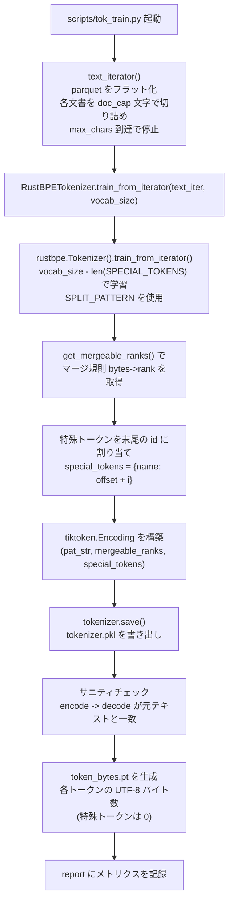
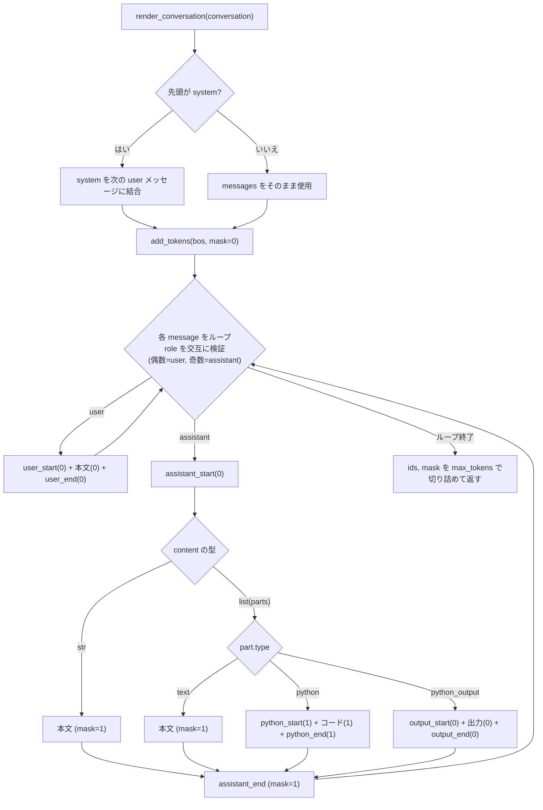
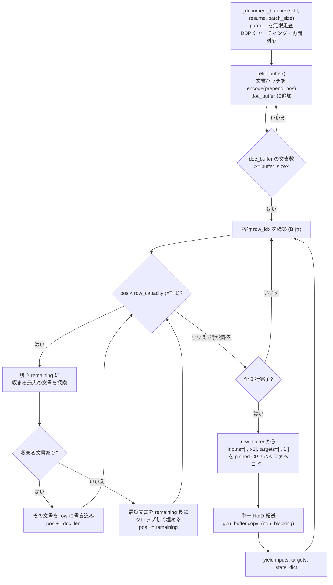
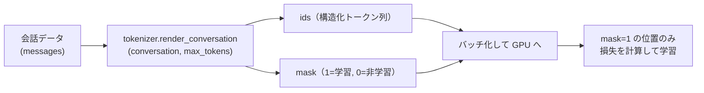

# トークナイザー・データローダー 実装解説

本ドキュメントは nanochat における **トークナイザー**（`nanochat/tokenizer.py`）と **データローダー**（`nanochat/dataloader.py`）の実装を解説するものです。事前学習（pretraining）・SFT（教師ありファインチューニング）・RL（強化学習）のそれぞれの段階で、テキストがどのようにトークン列へ変換され、GPU 上のバッチとして供給されるかを、コードに即して説明します。

---

## 1. トークナイザー（`nanochat/tokenizer.py`）

nanochat のトークナイザーは GPT-4 スタイルの BPE（Byte Pair Encoding）トークナイザーです。バイトレベルにフォールバックするため、任意の Unicode テキストを欠損なく可逆的に符号化できます。

### 全体構成

トークナイザーには 2 つの実装があり、用途に応じて使い分けます。

| 観点 | `HuggingFaceTokenizer` | `RustBPETokenizer` |
| --- | --- | --- |
| 位置づけ | HuggingFace `tokenizers` の薄いラッパー | `rustbpe`（学習）＋ `tiktoken`（推論）の組み合わせ |
| 学習 | `tokenizers.trainers.BpeTrainer` で学習可能 | `rustbpe.Tokenizer` で学習 |
| 推論（エンコード） | HuggingFace の `encode` | `tiktoken.Encoding`（高速） |
| バッチ並列エンコード | 非対応（`num_threads` は無視） | 対応（`encode_ordinary_batch(num_threads=...)`） |
| 永続化形式 | `tokenizer.json` | `tokenizer.pkl`（`tiktoken.Encoding` を pickle 化） |
| BOS トークン取得 | `<\|bos\|>` → なければ `<\|endoftext\|>` を探索 | `__init__` で確定した `bos_token_id` を保持 |
| nanochat での既定 | コメントアウト（参考実装） | **実際に使用**（`get_tokenizer()` が返す） |
| メリット | 学習・推論の両方を 1 つで完結 | 学習は Rust、推論は tiktoken でいずれも高速 |
| デメリット | API が分かりにくく低速 | 学習と推論で別ライブラリを使うため構成が二段構え |

両者は共通のインターフェース（`encode` / `decode` / `get_bos_token_id` / `encode_special` / `save` など）を持つため、上位コードからはほぼ同一に扱えます。nanochat の本番経路では `RustBPETokenizer` が使われており、`get_tokenizer()` は `RustBPETokenizer.from_directory(...)` を返します。

#### 共通の前処理（分割パターンと特殊トークン）

- **分割パターン（`SPLIT_PATTERN`）**: BPE マージの前にテキストを「事前トークン（pre-token）」に分割する正規表現です。GPT-4 のパターンをベースにしつつ、数字部分を `\p{N}{1,3}` から `\p{N}{1,2}` に変更しています。これは、小さな語彙サイズ（例: 32K）のモデルにおいて数字に多くのトークンを「浪費」しないための調整で、2 桁が最適と検証されています。
- **特殊トークン（`SPECIAL_TOKENS`）**:
  - `<|bos|>`: すべてのドキュメントの先頭に付与され、ドキュメントの区切りを表す Beginning of Sequence トークン。
  - 会話用トークン（ファインチューニング時のみ使用）: `<|user_start|>` / `<|user_end|>` / `<|assistant_start|>` / `<|assistant_end|>` / `<|python_start|>` / `<|python_end|>` / `<|output_start|>` / `<|output_end|>`。

---

### 1-A. トークナイザー学習フロー

トークナイザーの学習は `scripts/tok_train.py` を起点に行います。学習データ（parquet）からテキストを流し込み、BPE マージ規則と語彙を学習し、推論用の `tiktoken.Encoding` を構築して保存します。あわせて、bits-per-byte（BPB）評価のための「トークン ID → バイト数」のマッピングもキャッシュします。



ポイント:

- **語彙サイズの内訳**: `train_from_iterator` では `vocab_size - len(SPECIAL_TOKENS)` の語彙を学習し、特殊トークンは学習対象に含めず、学習後に末尾の ID（`tokens_offset + i`）として追加します。`vocab_size_no_special` は 256（バイト初期アルファベット分）以上であることが要求されます。
- **学習は Rust、推論は tiktoken**: `rustbpe` で得たマージ規則（`mergeable_ranks`）と分割パターン（`pattern`）をそのまま `tiktoken.Encoding` に渡すことで、学習結果を高速な推論経路へ橋渡しします。
- **`token_bytes.pt`**: 各トークン ID が UTF-8 で何バイトに相当するかを記録します（特殊トークンは 0）。これにより、語彙サイズに依存しない検証指標である bits-per-byte（BPB）を計算できます。

---

### 1-B. 事前学習用エンコード（`encode`）

事前学習では、生テキストを単純にトークン ID 列へ変換します。`RustBPETokenizer.encode` は文字列・文字列リストのいずれも受け付け、`prepend` / `append` で特殊トークン（ID または名前）を前後に付与できます。

```python
def encode(self, text, prepend=None, append=None, num_threads=8):
    if prepend is not None:
        prepend_id = prepend if isinstance(prepend, int) else self.encode_special(prepend)
    if append is not None:
        append_id = append if isinstance(append, int) else self.encode_special(append)

    if isinstance(text, str):
        ids = self.enc.encode_ordinary(text)
        if prepend is not None:
            ids.insert(0, prepend_id)
        if append is not None:
            ids.append(append_id)
    elif isinstance(text, list):
        # 複数文書をスレッド並列でエンコード（高速）
        ids = self.enc.encode_ordinary_batch(text, num_threads=num_threads)
        if prepend is not None:
            for ids_row in ids:
                ids_row.insert(0, prepend_id)
        if append is not None:
            for ids_row in ids:
                ids_row.append(append_id)
    return ids
```

ポイント:

- **`encode_ordinary` の使用**: 特殊トークンを「文字列として」検出することはせず、純粋に本文のみを BPE エンコードします。特殊トークンは `prepend` / `append` で明示的に挿入されるため、データ中に紛れ込んだ特殊文字列が誤って特殊トークンとして解釈される事故を防げます。
- **バッチ並列**: 文書リストを渡すと `encode_ordinary_batch(num_threads=...)` で並列エンコードされます。データローダーは大量の文書をまとめてエンコードするため、この並列化が効きます。
- **BOS の付与**: 事前学習のデータローダーは `prepend=bos_token` を指定して呼び出すため、各文書の先頭に必ず `<|bos|>` が入ります（後述 2-A）。

---

### 1-C. SFT 用会話トークン化（`render_conversation`）

SFT では「会話（conversation）」を 1 つのドキュメントとしてトークン化します。`render_conversation` は会話メッセージ列を、特殊トークンで構造化したトークン ID 列 `ids` と、同じ長さの **学習マスク** `mask` の組として返します。

#### `mask` の意味

`mask` は「その位置のトークンを Assistant が **学習対象とすべきか**」を表す 0/1 のフラグです。

- `mask = 1`: 損失（loss）を計算して学習する。**Assistant が生成すべきトークン**（応答本文、Python ツール呼び出しのコード、`<|assistant_end|>` など）。
- `mask = 0`: 損失を計算しない。**モデルが生成すべきでない／入力として与えられる文脈**（`<|bos|>`、ユーザー発話とその区切りトークン、Python の実行結果 `<|output_start|>...<|output_end|>` など）。

特に重要なのは、**Python ツールの出力（`python_output`）は `mask = 0`** である点です。これは、その出力が「実行時に Python から戻ってくるもの」であり、モデルが暗記・生成するものではないためです。一方、**Python の呼び出しコード自体（`python`）は `mask = 1`** で、モデルがツールを正しく呼び出せるよう学習します。



主な処理:

- **system メッセージの結合**: 先頭が `system` の場合、次の `user` メッセージの本文の前に結合（`system + "\n\n" + user`）してから処理します（元の会話は破壊しないよう `deepcopy`）。
- **role の交互チェック**: `i % 2 == 0` のとき `user`、奇数のとき `assistant` であることを assert で検証し、想定外の並びを防ぎます。
- **構造トークンのマスク**: `<|bos|>`、`<|user_start|>` / `<|user_end|>`、ユーザー本文、`<|output_*|>` とその中身は `mask = 0`。`<|assistant_start|>` も `mask = 0`（生成の起点であり、これ自体は教師しない）。Assistant 本文・`<|python_*|>`・Python コード・`<|assistant_end|>` は `mask = 1`。
- **切り詰め**: 最後に `ids[:max_tokens]` / `mask[:max_tokens]`（既定 `max_tokens=2048`）で長さを制限し、OOM を防ぎます。

補助として `visualize_tokenization(ids, mask)` があり、`mask = 1` を緑、`mask = 0` を赤で色分けして表示し、トークン化結果のデバッグに使えます。

---

### 1-D. RL 用トークン化（`render_for_completion`）

RL では、Assistant に「続きを生成させる」ためのプロンプトを作ります。SFT と異なり、学習マスクは不要（生成した補完に対して別途報酬を計算するため）で、`ids` のみを返します。

```python
def render_for_completion(self, conversation):
    conversation = copy.deepcopy(conversation)       # 元を破壊しない
    messages = conversation["messages"]
    assert messages[-1]["role"] == "assistant"       # 末尾は Assistant 前提
    messages.pop()                                    # 末尾の Assistant メッセージを削除

    ids, mask = self.render_conversation(conversation)  # マスクは捨てる

    assistant_start = self.encode_special("<|assistant_start|>")
    ids.append(assistant_start)                       # 生成の起点を付与
    return ids
```

ポイント:

- **末尾 Assistant メッセージの除去**: 「正解の応答」を取り除き、その直前までを文脈として与えます。
- **`render_conversation` の再利用**: 内部で `render_conversation` を呼び、得られた `mask` は破棄します。
- **`<|assistant_start|>` の付与**: 末尾に Assistant の開始トークンを足すことで、モデルがこの位置から応答を生成（complete）するよう促します。

---

## 2. データローダー（`nanochat/dataloader.py`）

データローダーは事前学習用で、parquet に格納された大量のテキスト文書を読み出し、トークン化し、**BOS 整列 Best-Fit パッキング**で `(B, T)` のバッチを組み立てて GPU に転送します。

ファイル冒頭のドキュメントにある通り、この BOS 整列方式は単純な連結方式に比べ T=2048 で約 35% のトークンをクロップで失いますが、**すべての行が BOS から始まり、各トークンが必ず同一ドキュメント内の BOS まで遡ってアテンションできる**ため、文脈をまたいだ「紛らわしい」トークンが減るという利点があります。

### 全体構成



エントリポイントは 2 つあります。

- `tokenizing_distributed_data_loader_with_state_bos_bestfit(...)`: `(inputs, targets, state_dict)` を yield。`state_dict` は再開（resume）に必要な位置情報を含みます。
- `tokenizing_distributed_data_loader_bos_bestfit(...)`: 上記をラップし、`state_dict` を省いて `(inputs, targets)` のみを yield する簡便版。

---

### 2-A. ドキュメントバッチ生成（`_document_batches`）

`_document_batches` は parquet ファイル群を無限に走査し、`tokenizer_batch_size` 件ずつの文書テキストのリストを、位置情報 `(pq_idx, rg_idx, epoch)` とともに yield する無限イテレータです。

```python
def _document_batches(split, resume_state_dict, tokenizer_batch_size):
    ddp, ddp_rank, ddp_local_rank, ddp_world_size = get_dist_info()
    parquet_paths = list_parquet_files(...)
    # 最終ファイルを val、それ以外を train に割り当て
    parquet_paths = parquet_paths[:-1] if split == "train" else parquet_paths[-1:]
    ...
    while True:                      # マルチエポックのため無限ループ
        while pq_idx < len(parquet_paths):
            pf = pq.ParquetFile(filepath)
            ...
            rg_idx = ddp_rank        # ランクごとに開始 row group をずらす
            while rg_idx < pf.num_row_groups:
                rg = pf.read_row_group(rg_idx)
                batch = rg.column('text').to_pylist()
                for i in range(0, len(batch), tokenizer_batch_size):
                    yield batch[i:i+tokenizer_batch_size], (pq_idx, rg_idx, epoch)
                rg_idx += ddp_world_size   # 次の担当 row group へ
            pq_idx += 1
        first_pass = False
        epoch += 1
```

#### DDP シャーディングの説明

分散データ並列（DDP）では、各 GPU プロセス（ランク）が **重複なく** データを分担する必要があります。本実装は **row group 単位** でシャーディングします。

- 各ランクは自分の `ddp_rank` を開始インデックスとして row group を読み始め、`ddp_world_size` ずつスキップして進みます（`rg_idx = ddp_rank; rg_idx += ddp_world_size`）。これにより、row group 0,1,2,... が world_size 個のランクへストライド分割され、どのランクも同じ row group を読みません。
- **train / val 分割**: parquet ファイル一覧の最終ファイルを val、残り全部を train に使います。
- **マルチエポック**: 全 parquet を走査し終えると `epoch += 1` して最初から繰り返す無限イテレータです。
- **近似的な再開（resume）**: `resume_state_dict` がある場合、保存された `pq_idx` / `rg_idx` / `epoch` から再開します。同一ファイル上で再開する初回パスでは、`base_idx = resume_rg_idx // ddp_world_size` を 1 つ進め（`base_idx += 1`）、`rg_idx = base_idx * ddp_world_size + ddp_rank` として、再開直後にデータを重複させないようにします（あくまで「近似的」な再開）。

---

### 2-B. BOS-aligned Best-Fit パッキング

各行（長さ `row_capacity = T + 1`）を、バッファ `doc_buffer` 内の文書から **Best-Fit（最適適合）** で詰めていきます。狙いは「パディングを一切作らず（100% 利用率）、かつクロップによるトークン損失を最小化する」ことです。

アルゴリズム（1 行あたり）:

1. バッファに十分な文書がたまるまで `refill_buffer()` で補充する。
2. 残り容量 `remaining` に **完全に収まる文書のうち最大** のものを選び、行に書き込む。
3. 何も収まらなくなるまで 2 を繰り返す。
4. もう収まる文書がなくなったら、バッファ内の **最短文書をクロップ** して残りをちょうど埋める（端数を埋め、無駄を最小化）。

```python
row_capacity = T + 1
...
while True:
    for row_idx in range(B):
        pos = 0
        while pos < row_capacity:
            # バッファに十分な文書を確保
            while len(doc_buffer) < buffer_size:
                refill_buffer()

            remaining = row_capacity - pos

            # 完全に収まる最大の文書を探索（Best-Fit）
            best_idx = -1
            best_len = 0
            for i, doc in enumerate(doc_buffer):
                doc_len = len(doc)
                if doc_len <= remaining and doc_len > best_len:
                    best_idx = i
                    best_len = doc_len

            if best_idx >= 0:
                # 収まる文書あり: そのまま書き込む
                doc = doc_buffer.pop(best_idx)
                doc_len = len(doc)
                row_buffer[row_idx, pos:pos + doc_len] = torch.tensor(doc, dtype=torch.long)
                pos += doc_len
            else:
                # 収まる文書なし: 最短文書をクロップして残りをちょうど埋める
                shortest_idx = min(range(len(doc_buffer)), key=lambda i: len(doc_buffer[i]))
                doc = doc_buffer.pop(shortest_idx)
                row_buffer[row_idx, pos:pos + remaining] = torch.tensor(doc[:remaining], dtype=torch.long)
                pos += remaining
```

ポイント:

- **すべての行が BOS から始まる**: `refill_buffer()` が `encode(..., prepend=bos_token)` で各文書の先頭に `<|bos|>` を付けてからバッファへ積むため、行の先頭は常に BOS になります。
- **100% 利用率（パディングなし）**: ステップ 4 のクロップにより `row_capacity` をちょうど埋めるので、行に空き（パディング）が残りません。すべてのトークンが学習対象になります。
- **クロップは最短文書に対して**: 端数を埋める際は最短文書を切り詰めることで、捨てるトークン量を抑えます。それでも T=2048 では全体の約 35% のトークンがクロップで失われます。
- **バッファサイズの役割**: `buffer_size`（既定 1000）だけ文書を保持してから探索することで、Best-Fit の候補を十分確保し、フィットの質を高めます。
- **`row_capacity = T + 1`**: 入力 `inputs` と 1 つずらしの教師 `targets` を作るため、行は T+1 個のトークンを保持します（次節）。

---

### 2-C. メモリ管理と GPU 転送

データローダーはループ毎に新しいテンソルを確保せず、**事前に確保した永続バッファ** を再利用することで、メモリ確保のオーバーヘッドと GC 圧を避けます。

```python
use_cuda = device == "cuda"
# Python リストを作らず行を組み立てるための作業バッファ
row_buffer = torch.empty((B, row_capacity), dtype=torch.long)
# CPU 側ステージング領域（pin_memory）。レイアウトは [inputs (B*T) | targets (B*T)]
cpu_buffer = torch.empty(2 * B * T, dtype=torch.long, pin_memory=use_cuda)
# GPU 側の永続バッファ
gpu_buffer = torch.empty(2 * B * T, dtype=torch.long, device=device)
# 各バッファへの便宜的なビュー
cpu_inputs  = cpu_buffer[:B * T].view(B, T)
cpu_targets = cpu_buffer[B * T:].view(B, T)
inputs  = gpu_buffer[:B * T].view(B, T)
targets = gpu_buffer[B * T:].view(B, T)
...
# row_buffer から 1 つずらして inputs/targets を作り、pinned CPU バッファへコピー
cpu_inputs.copy_(row_buffer[:, :-1])    # 入力: 先頭〜末尾-1
cpu_targets.copy_(row_buffer[:, 1:])    # 教師: 1 つ先のトークン

state_dict = {"pq_idx": pq_idx, "rg_idx": rg_idx, "epoch": epoch}

# 単一の HtoD 転送（非同期）。inputs/targets は gpu_buffer のビューなので即座に最新化される
gpu_buffer.copy_(cpu_buffer, non_blocking=use_cuda)
yield inputs, targets, state_dict
```

ポイント:

- **`pin_memory`（ページロックメモリ）**: `cpu_buffer` を `pin_memory=use_cuda` で確保します。ページロックされた CPU メモリからの転送は、`non_blocking=True` による真の非同期コピー（DMA）を可能にし、Host→Device 転送が高速化されます（CUDA を使う場合のみ）。
- **`non_blocking`**: `gpu_buffer.copy_(cpu_buffer, non_blocking=use_cuda)` により、ピン留め CPU バッファからの転送を非同期で発行します。これにより転送と CPU 側の次バッチ準備をオーバーラップしやすくなります。
- **単一 HtoD 転送**: `inputs` と `targets` を 1 本の連続バッファ（`cpu_buffer` / `gpu_buffer`、レイアウトは `[inputs (B*T) | targets (B*T)]`）にまとめることで、Host→Device 転送を **1 回** に削減します。`inputs` / `targets` はその GPU バッファへのビューなので、`copy_` 後に追加の確保なしで最新データを指します。
- **永続バッファ**: `row_buffer` / `cpu_buffer` / `gpu_buffer` はループ外で 1 度だけ確保され、毎イテレーションで `copy_` により中身を上書きします。新規テンソルを作らないため、確保コストとメモリ断片化を避けられます。
- **`inputs` / `targets` の 1 トークンずらし**: 言語モデルの「次トークン予測」のため、`inputs = row[:, :-1]`、`targets = row[:, 1:]` と 1 つずらして作ります。これが `row_capacity = T + 1` を必要とする理由です。

---

## 3. トークナイザーとデータローダーの連携

最後に、各学習段階でトークナイザーとデータローダー（あるいはトークン化処理）がどう連携するかを整理します。

### 3-1. 事前学習（pretraining）のフロー


- データローダーがバッチ単位の生テキストをトークナイザーの **バッチ並列 `encode`** に流し込み、各文書に BOS を付与します。
- トークン列は Best-Fit パッキングで `(B, T+1)` に整列され、1 つずらしの `inputs` / `targets` として供給されます。
- **マスクは使いません**（全トークンが学習対象）。利用率は 100% で、約 35% はクロップにより捨てられます。

### 3-2. SFT（教師ありファインチューニング）のフロー



- 事前学習のような Best-Fit データローダーは使わず、**`render_conversation` が会話 1 件を 1 ドキュメントとしてトークン化**します。
- 返り値の `mask` により、Assistant の応答・ツール呼び出し（`mask=1`）だけを学習し、ユーザー発話・Python 出力・構造トークンの一部（`mask=0`）は損失計算から除外します。
- これにより「モデルが生成すべき部分」だけを選択的に教師できます。

### 3-3. RL（強化学習）のフロー


- `render_for_completion` が会話末尾の Assistant メッセージを取り除き、`<|assistant_start|>` を付けて「ここから生成せよ」というプロンプト `ids` を作ります。
- **マスクは返しません**。学習信号は、生成された補完（rollout）に対して別途計算される **報酬** から得られます。
- 内部で `render_conversation` を再利用するため、特殊トークンによる会話構造の表現は SFT と一貫しています。

---

### まとめ

- **トークナイザー**（`tokenizer.py`）は GPT-4 スタイルの BPE 実装で、学習は `rustbpe`、推論は `tiktoken` を用いる `RustBPETokenizer` が本番経路。用途別に `encode`（事前学習）/ `render_conversation`（SFT・マスク付き）/ `render_for_completion`（RL）を提供する。
- **データローダー**（`dataloader.py`）は事前学習用で、DDP シャーディング・近似再開に対応した `_document_batches` と、BOS 整列 Best-Fit パッキング、`pin_memory` + `non_blocking` + 永続バッファによる効率的な単一 HtoD 転送を組み合わせる。
- 3 段階（事前学習・SFT・RL）はいずれも同じトークナイザーを共有しつつ、必要なトークン化 API とデータ供給経路を使い分けている。
